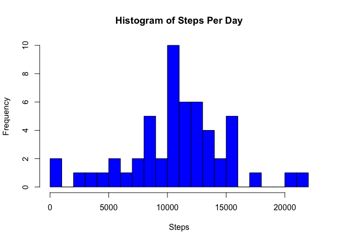
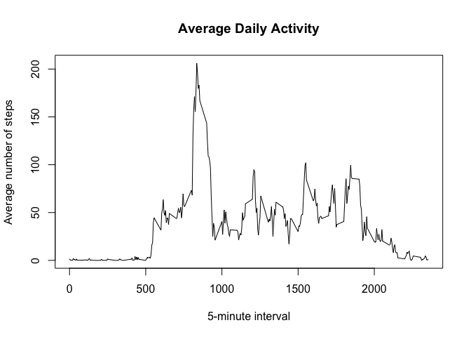
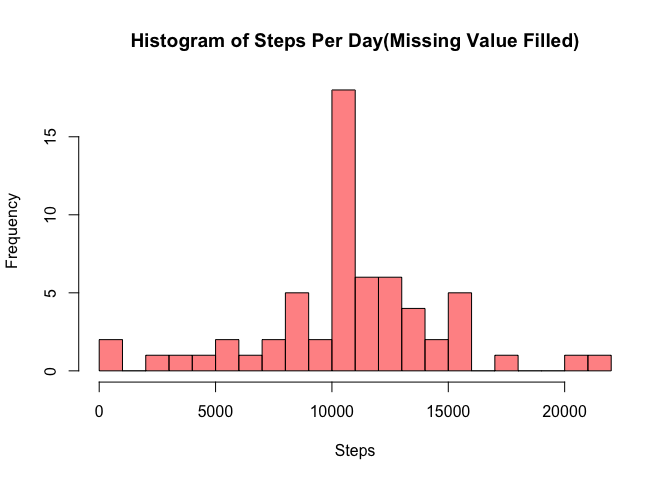
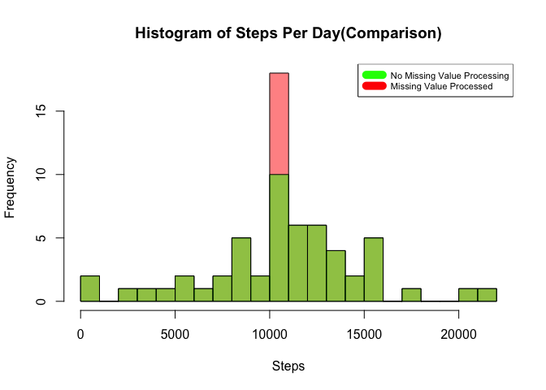
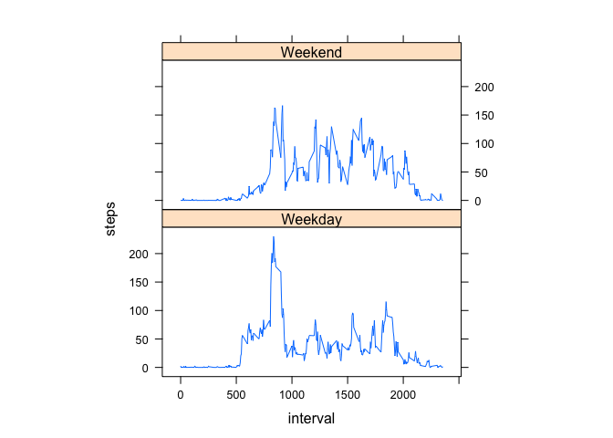

# Reproducible Research: Peer Assessment 1

This document is a R markdown for Reproducible Research course on Coursera. Click Knit HTML button in R studio to generate HTML from this document.

## Loading and preprocessing the data
Unzip the compressed file and load into data frame with type conversion.

```r
# 1. Load the data 
unzip('activity.zip')
df <- read.csv('activity.csv')
# 2.Process/transform the data (if necessary) into a format suitable for your analysis
df$date <- as.Date(df$date)
```

## What is mean total number of steps taken per day?

```r
# 1. Calculate the total number of steps taken per day
df_perday <- tapply(df$steps, df$date, sum)
# 2. Make a histogram of the total number of steps taken each day
hist(df_perday, main = "Histogram of Steps Per Day", 
             xlab = "Steps", ylab = "Frequency", 
             col = "blue", breaks = 20)
```

 

We now have mean and median of the total number of steps taken per day.

```r
# 3. Calculate and report the mean and median of the total number of steps taken per day
summary(df_perday)
```

```
##    Min. 1st Qu.  Median    Mean 3rd Qu.    Max.    NA's 
##      41    8841   10760   10770   13290   21190       8
```
  
## What is the average daily activity pattern?
Average daily activity plot:

```r
# 1. Make a time series plot (i.e. type = "l") of the 5-minute interval (x-axis) and the average number of steps taken, averaged across all days (y-axis)
df_daily_average <- aggregate(df$steps, list(df$interval), mean, na.rm=TRUE)
colnames(df_daily_average) <- c('interval', 'average.steps')
plot(df_daily_average, type='l', main="Average Daily Activity", "xlab" = "5-minute interval", ylab="Average number of steps")
```

 
  
We can now conclude the maximum steps taken daily is around 8:35 AM

```r
# 2. Which 5-minute interval, on average across all the days in the dataset, contains the maximum number of steps?
max_index <- which.max(df_daily_average$average.steps)
df_daily_average[max_index, 1]
```

```
## [1] 835
```
  
## Imputing missing values

Count of missing values:

```r
# 1. Calculate and report the total number of missing values in the dataset (i.e. the total number of rows with NAs)
sum(is.na(df$steps))
```

```
## [1] 2304
```

Filling missing values by using the mean for that 5-minute interval

```r
# 2. Devise a strategy for filling in all of the missing values in the dataset. The strategy does not need to be sophisticated. For example, you could use the mean/median for that day, or the mean for that 5-minute interval, etc.
df_merge <-merge(df, df_daily_average, by.x='interval', by.y='interval', all=TRUE)
df_merge <- transform(df_merge, steps=ifelse(is.na(steps), average.steps, steps))
# 3. Create a new dataset that is equal to the original dataset but with the missing data filled in.
df_fillin <- df_merge[c(1,2,3)]
```

Make a histogram of the total number of steps taken each day and calculate and report the mean and median total number of steps taken per day.

```r
# 4. Make a histogram of the total number of steps taken each day and Calculate and report the mean and median total number of steps taken per day. Do these values differ from the estimates from the first part of the assignment? What is the impact of imputing missing data on the estimates of the total daily number of steps?
df_fillin_perday <- tapply(df_fillin$steps, df_fillin$date, sum)
hist(df_fillin_perday, col=rgb(1, 0, 0, 0.5), 
            main = "Histogram of Steps Per Day(Missing Value Filled)", 
            xlab = "Steps", ylab = "Frequency", 
            breaks = 20)
```

 

```r
summary(df_fillin_perday)
```

```
##    Min. 1st Qu.  Median    Mean 3rd Qu.    Max. 
##      41    9819   10770   10770   12810   21190
```
  
From the mean and median value of the average steps per day, we know that the processing of missing value only have slight effects over the conclusion. The below histogram comparison also supports our view:

```r
hist(df_fillin_perday, col=rgb(1, 0, 0, 0.5), main = "Histogram of Steps Per Day(Comparison)", 
             xlab = "Steps", ylab = "Frequency", 
             breaks = 20)
hist(df_perday, col=rgb(0, 1, 0, 0.5), main = "", 
             xlab = "", ylab = "", 
             breaks = 20, add=TRUE)
legend("topright", c("No Missing Value Processing", "Missing Value Processed"), col=c("green", "red"), lwd=10, cex=0.7)
```

 

## Are there differences in activity patterns between weekdays and weekends?

The following panel plot shows that people tend to have more exercises across all the day on weekends, while they have less physical movements during work.

```r
# 1. Create a new factor variable in the dataset with two levels 'weekday' and 'weekend' indicating whether a given date is a weekday or weekend day.
df_fillin$weekday <- weekdays(df_fillin$date)
df_fillin$weekend <- ifelse(df_fillin$weekday == 'Saturday' | df_fillin$weekday == 'Sunday', 'Weekend', 'Weekday')
df_fillin_week_average <- aggregate(steps~interval+weekend, data=df_fillin, mean)
# 2. Make a panel plot containing a time series plot (i.e. type = "l") of the 5-minute interval (x-axis) and the average number of steps taken, averaged across all weekday days or weekend days (y-axis). See the README file in the GitHub repository to see an example of what this plot should look like using simulated data.
library(lattice)
xyplot(steps~interval|factor(weekend), data=df_fillin_week_average, aspect=1/2,type="l")
```

 

